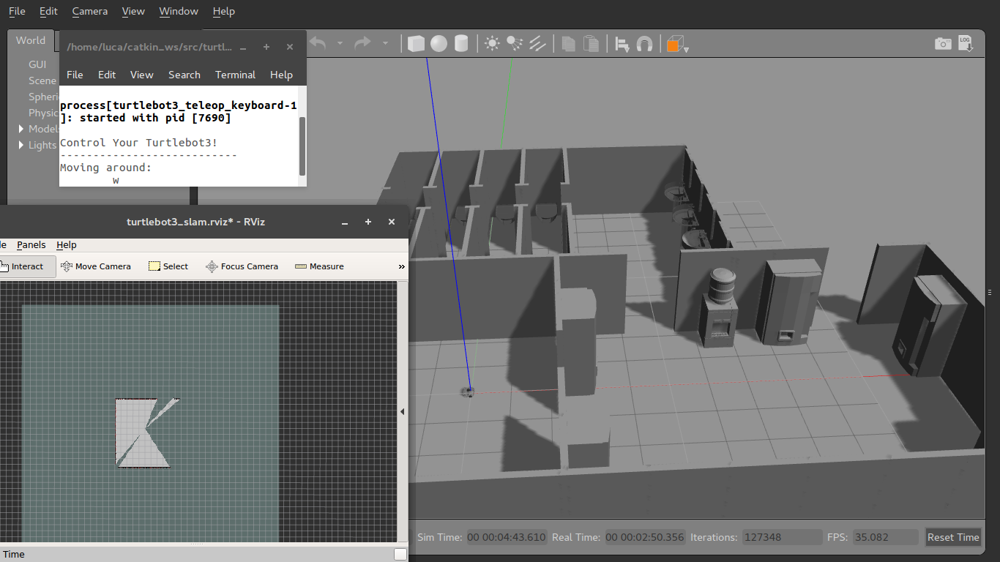
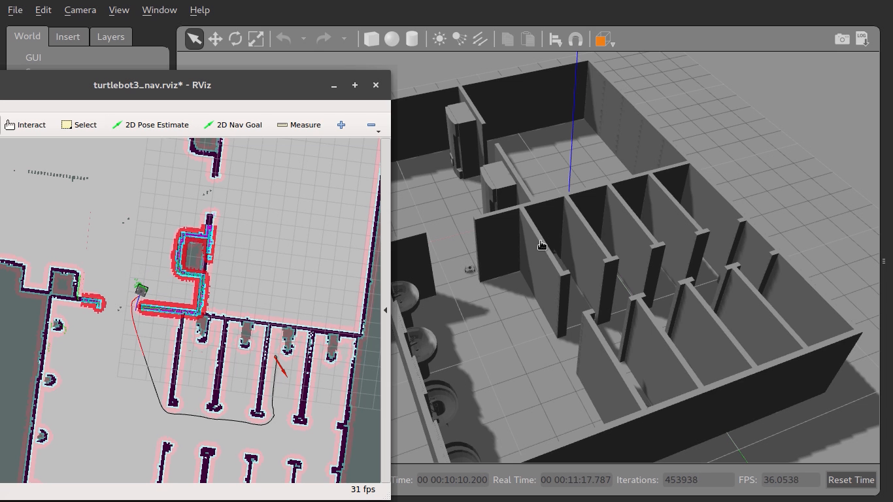

# Univr Cyberphysical Lab course - Homework 2
Second homework assignement of the Cyberphysical Lab course at University of Verona, academic year 2017/2018.

Tha assignment was the following:
> Create a Gazebo world which replicates one of these environments:
> - A room of the Computer Science department at University of Verona
> - A reconstruction of the TurtleBot3 auto race circuit

> Then, generate and save a map of the environment using the virtual TurtleBot3 simulator.
> Make a video showing the robot completing a path with RViz

We chose to make a model of the boys' bathroom, the vending machine room and another adiacent room of the _Ca' Vignal 2_ department's basement.

## Package structure
The package contains the following files:
- `bagni_e_macchine.world` which contains the XML definition of the simulation world
- `ros_homework2.launch` which is the ROS launcher file
- `setup.sh` which is a Bash script that copies the files in the `turtlebot3_simulation` package
Inside the `ros_homework2` directory there's the Collada model of the world.

## How to launch
Be sure to have the `turtlebot3_simulations` package installed in your workspace (check [here](http://emanual.robotis.com/docs/en/platform/turtlebot3/simulation/) for details). 
Simply clone the repository into your ROS workspace, then run `setup.sh`.
Assuming that your workspace is in `~/catkin_ws`, the commands are:
> `git clone https://github.com/JackHack96/ros_homework2.git`  
> `./setup.sh`

## Screenshots

  
  
1. Creation of the map with RViz and SLAM

  
  
2. Autonomous navigation in our map created in the previous point

For other screenshots, refer to the _screenshot_ folder.

## Video

  <video src="video.mp4" width="320" height="200" controls preload></video>
  
2. Autonomous navigation in our map created in the previous point

## Used software
- [Autodesk© AutoCAD© 2018](https://www.autodesk.it/products/autocad/overview) for modeling the world
- [Blender](https://www.blender.org/) for converting the model in Collada DAE format and adjusting it
- [Gazebo](http://gazebosim.org/) for the actual simulation

## Authors
* Matteo Iervasi - Bathroom model, launcher and setup file
* Luca Arietti - Vending machine model, video recording
* David Alessandrini - Third room model, video editing

---
This file is part of `ros_homework2` and it is distributed under the terms of the GNU General Public License 3

`ros_homework2` is distributed in the hope that it will be useful, but WITHOUT ANY WARRANTY; without even the implied warranty of MERCHANTABILITY or FITNESS FOR A PARTICULAR PURPOSE. See the GNU General Public License 3 for more details.

You should have received a copy of the GNU General Public License along with `ros_homework2`. If not, see http://www.gnu.org/licenses/.
